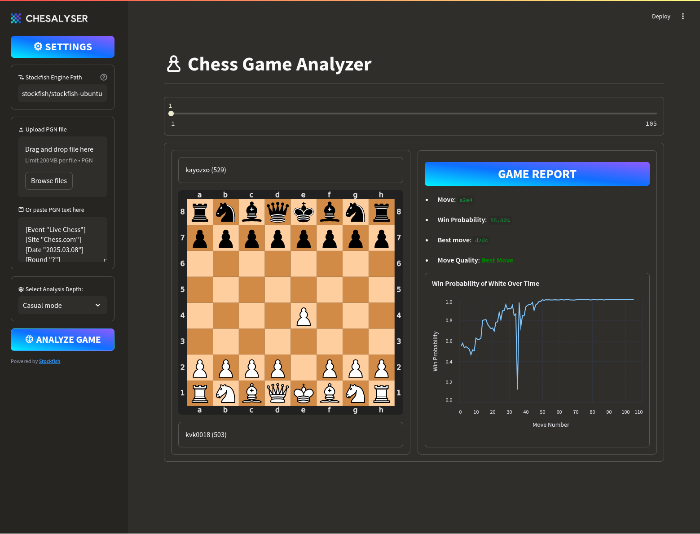

---

[](https://streamlit.io/)
[](https://www.python.org/)
[](https://stockfishchess.org/)

A powerful chess game analyzer built with Python and Streamlit, leveraging Stockfish for position evaluation. Provides detailed move analysis, win probability tracking, and interactive game review.



## 🌟 Features

- **PGN File Analysis**: Upload games or paste PGN text directly
- **Move Classification**:
  - 🟢 Best Move 🟦 Good Move 🟡 Inaccuracy 🟠 Mistake 🔴 Blunder
- **Interactive Chess Board**: SVG-based board visualization
- **Win Probability Graph**: Track advantage fluctuations through the game
- **Multi-Depth Analysis**: Choose from 5 analysis modes (Beginner to Stockfish)
- **Opening Book Integration**: Detect theoretical moves and opening names
- **Book Accuracy Tracking**: See how well players followed opening theory
- **Game Metadata Display**: Player names, Elo ratings, and game results
- **Modern UI**: Gradient headers and responsive design

## ⚙️ Installation

### Prerequisites

- Python 3.9+
- Stockfish engine (installation varies by OS)
- Polyglot opening book (optional, for opening analysis)

### All Platforms

```bash
# Clone repository
git clone https://github.com/kayozxo/chesalyser.git
cd chesalyser

# Install Python dependencies
pip install -r requirements.txt
```

### OS-Specific Setup

#### **Windows**

1. Download Stockfish:
   - [Official Windows build](https://stockfishchess.org/download/windows/)
   - Extract ZIP.
2. Update engine path in the provided text area in sidebar.

#### **macOS**

```bash
# Using Homebrew (recommended)
brew install stockfish

# Or manual download:
# 1. Get macOS build from https://stockfishchess.org/download/mac/
# 2. Make executable:
chmod +x stockfish/stockfish-macos-x86-64

#3. Update engine path in the provided text area in sidebar.
```

#### **Linux**

```bash
# Clone this repository

# Make executable
chmod +x stockfish/stockfish-ubuntu-x86-64-sse41-popcnt
```

### Opening Book Setup (Optional)

The analyzer supports Polyglot opening books for theoretical move detection and opening name recognition.

#### Download Opening Books

1. **Recommended Sources**:
   - [Chessable Polyglot Books](https://www.chessable.com/blog/polyglot-opening-books/)
   - [ChessDB Opening Books](https://chessdb.cn/book.aspx)
   - [GitHub: Various Polyglot Books](https://github.com/niklasf/python-chess/tree/master/data/polyglot)

2. **Download a popular book** (e.g., `varied.bin` or `performance.bin`)

#### Installation

```bash
# Create opening_books directory
mkdir -p opening_books

# Move your downloaded .bin file to the directory
mv /path/to/your/book.bin opening_books/varied.bin
```

#### Configuration

- The app will automatically search for books in:
  - `opening_books/varied.bin`
  - `opening_books/performance.bin`
  - `opening_books/book.bin`
  - `books/varied.bin`
  - `books/performance.bin`

- Or specify a custom path in the sidebar under "Opening Book Path"

#### What Opening Books Provide

- **Theoretical Move Detection**: Identifies moves that follow established opening theory
- **Opening Name Recognition**: Automatically detects openings like "Sicilian Defense", "Queen's Gambit", etc.
- **Book Accuracy Statistics**: Shows how well players followed opening theory
- **Theory Exit Detection**: Identifies when players deviate from known theory

## 🚀 Usage Notes

- **First Run**: The app may take 30-60 seconds to initialize Stockfish
- **Windows Users**: Add exception for Stockfish in your antivirus if needed
- **M1/M2 Mac Users**: Use Rosetta if using x86 build, or compile ARM version

## 🚨 Troubleshooting

**Platform-Specific Issues**

| OS      | Common Fixes                                                               |
| ------- | -------------------------------------------------------------------------- |
| Windows | 1. Add `.exe` extension if missing<br>2. Run as Administrator              |
| macOS   | 1. `xattr -cr stockfish/...` (remove quarantine flags)<br>2. Use ARM build |
| Linux   | 1. Install `libnss3` if missing<br>2. Check 32/64-bit compatibility        |

## 🚀 Usage

### Local Development

1. Start the application:

```bash
streamlit run main.py
```

2. In the sidebar:

   - Paste your engine path (linux users: ignore this step)
   - Upload PGN file or paste game text
   - Select analysis depth (Beginner to Stockfish mode)
   - Click "ANALYZE GAME"

3. Explore results:
   - Interactive move slider
   - Chess board visualization
   - Move quality assessment
   - Win probability graph
   - Best move suggestions

### Docker Deployment

#### Using Docker Compose (Recommended)

```bash
# Build and run with Docker Compose
docker-compose up --build

# Access the app at http://localhost:8501
```

#### Using Docker Directly

```bash
# Build the Docker image
docker build -t chess-analyzer .

# Run the container
docker run -p 8501:8501 chess-analyzer

# Access the app at http://localhost:8501
```

### Hugging Face Spaces Deployment

1. Create a new Space on [Hugging Face](https://huggingface.co/spaces)
2. Choose "Docker" as the Space type
3. Push your code to the Space repository
4. The app will automatically deploy with Stockfish included

**Note**: The Dockerfile automatically downloads and configures Stockfish, so no manual setup is needed for containerized deployments.

## 📊 Analysis Metrics

| Metric | Description |
| --- | --- |
| Win Probability | White's winning chances based on current evaluation |
| Centipawn Evaluation | Numeric assessment of position advantage |
| Score Change | Difference in evaluation from previous move |
| Piece Moved | Type of piece moved (Queen, Knight, etc.) |
| Capture Detection | Identifies if move resulted in capture |
| Opening Name | Automatically detected opening (e.g., Sicilian Defense) |
| Book Accuracy | Percentage of moves following opening theory |
| Book Move Status | Whether each move is theoretical (📖) or novelty |
| Theory Exit Point | Move number when game left opening theory |
| Game Phase | Current phase: Opening, Middlegame, or Endgame |
| Player Strength | Average Elo rating used for context-aware classification |

## 🎯 Enhanced Move Classification

The analyzer uses intelligent, context-aware move classification that adapts to:

### Game Phase Detection
- **Opening**: First 10 moves or when material > 28 pieces
- **Middlegame**: Moves 10-25 or when material 16-28 pieces  
- **Endgame**: After move 25 or when material < 16 pieces

### Player Strength Adaptation
Classification thresholds automatically adjust based on player ratings:

| Rating Range | Multiplier | Description |
| --- | --- | --- |
| < 1200 | 1.5x | More lenient for beginners |
| 1200-1400 | 1.3x | Lenient for casual players |
| 1400-1600 | 1.1x | Slightly lenient |
| 1600-1800 | 1.0x | Standard classification |
| 1800-2000 | 0.9x | Stricter for strong players |
| 2000-2200 | 0.8x | Strict for experts |
| > 2200 | 0.7x | Very strict for masters |

### Dynamic Thresholds
Each game phase has different base thresholds that are further adjusted by:
- **Capture moves**: 20% more lenient (captures are naturally more complex)
- **Queen moves**: 10% stricter (queen mistakes are more critical)
- **Player strength**: Rating-based multiplier

This ensures fair and accurate move evaluation regardless of player level or game stage.

## 🛠️ Customization

Modify these components for different behavior:

1. **Analysis Depth Settings** (in `main.py`):

```python
depth_options = {
    10: "Beginner mode",
    15: "Casual mode",
    20: "Serious mode",
    25: "Grandmaster mode",
    30: "Stockfish mode",
}
```

2. **Move Classification Thresholds** (in `classify_move()` function):

```python
# Adjust these values for different move ratings
if is_capture:
    if score_change < 30:  # Modify these thresholds
        return "Best Move", "green"
```

## 🚨 Troubleshooting

**Common Issues**:~~S~~

1. **Stockfish Not Found**:

   - Verify executable path in sidebar settings
   - Ensure correct permissions: `chmod +x stockfish/...`

2. **PGN Parsing Errors**:

   - Validate PGN format using [PGN Validator](https://www.chess.com/pgn-viewer)
   - Ensure game headers are present

3. **Analysis Timeouts**:
   - Reduce analysis depth
   - Use better hardware for deep analysis

## 📜 License

MIT License - See [LICENSE](LICENSE) for details

## 🤝 Credits

- Chess engine: [Stockfish](https://stockfishchess.org/)
- Chess library: [python-chess](https://python-chess.readthedocs.io/)
- UI Framework: [Streamlit](https://streamlit.io/)

---

**Disclaimer**: This project is not affiliated with Chess.com or Lichess. Intended for educational purposes only. Use at your own risk in competitive environments.
